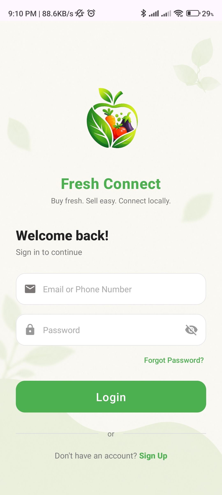
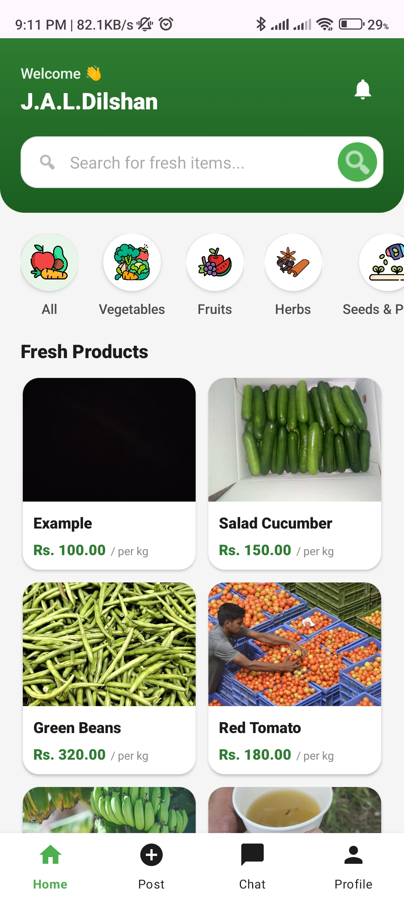
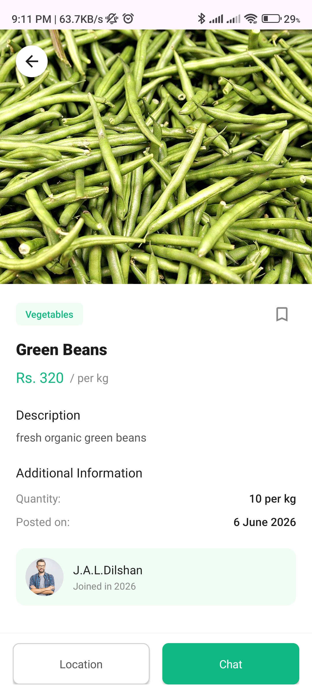

# FreshConnect 🌱

Fresh Connect is a mobile application developed as part of a university final project for the Mobile Application Development (Android) module. The application is designed to connect users with nearby farmers and home gardeners, enabling the buying and selling of fresh fruits and vegetables through a simple and user-friendly platform.

## 🌟 Key Features

* **User Authentication:** Secure Login and Sign-up functionality powered by Supabase.
* **Product Marketplace:** Browse through categories like Vegetables, Fruits, and Spices.
* **Post Advertisements:** Sellers can add items with images, detailed descriptions, and location.
* **Real-time Chat:** Built-in messaging system to negotiate and communicate directly with sellers.
* **Location Services:** Integrated Maps to pick and view the exact location of the products/sellers.
* **Profile Management:** Manage your own ads (Edit/Delete) and save favorite items for later.
* **Modern UI:** Beautiful and user-friendly interface utilizing Android Material Design components and custom themes.

## 🛠 Tech Stack

* **Language:** Java
* **UI:** XML Layouts (Material Components, ConstraintLayout)
* **Backend:** Supabase (Database & Authentication)
* **Networking:** OkHttp, Gson
* **Maps:** Google Play Services Maps & Location API
* **Minimum SDK:** API 26 (Android 8.0)
* **Target SDK:** API 35

## 📸 Screenshots
*(Add screenshots of your app here)*
<p align="center">
  
  
  
</p>

## 🚀 How to Run Locally

1. **Clone the repository:**
   ```bash
   git clone https://github.com/your-username/FreshConnect.git
   ```

2. **Open in Android Studio:**
   - Open Android Studio and select `Open an existing Android Studio project`.
   - Navigate to the cloned directory and select it.

3. **Configure API Keys:**
   - **Google Maps API:** Add your Google Maps API key in the `AndroidManifest.xml` or `local.properties` file.
   - **Supabase Configuration:** Ensure your Supabase API URL and keys are correctly set in the `network` package (e.g., `SupabaseClient.java`).

4. **Build and Run:**
   - Sync the Gradle project.
   - Run the app on an emulator or a physical Android device.

## 📁 Project Structure

* `models/` - Data models (User, Product, Message, etc.)
* `network/` - API and Supabase client configurations
* `ui/` - Activities and Fragments organized by features
  * `home/` - Main feed and product search
  * `chat/` - Messaging features
  * `login/` - Authentication screens
  * `profile/` - User profile, saved items, and ad management
  * `item/` - Adding and editing products, Map integration

## 🤝 Contributing

Contributions, issues, and feature requests are welcome! 

## 📝 License

This project is licensed under the MIT License.
